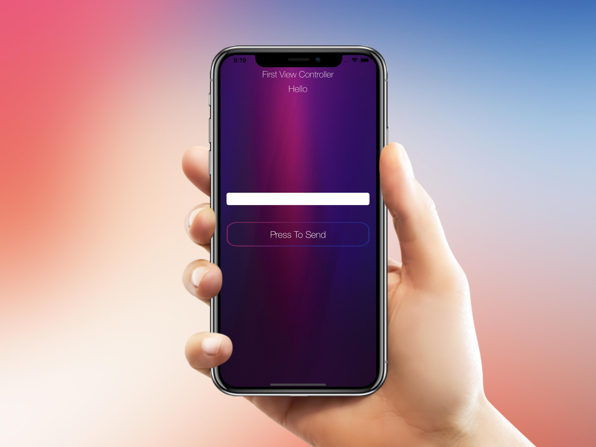

# Pass data between ViewControllers via Delegate Protocols
Pass data between ViewControllers via Delegate & Protocols using the Swift Programming Language
___
## Example how the UI looks

* First View Controller with a keyboard and input 

___

* First View Controller with an empty text field

___

* Second View Controller with an alert controller

